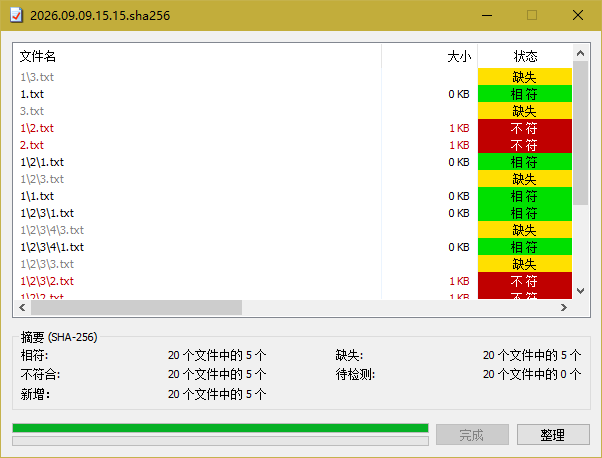
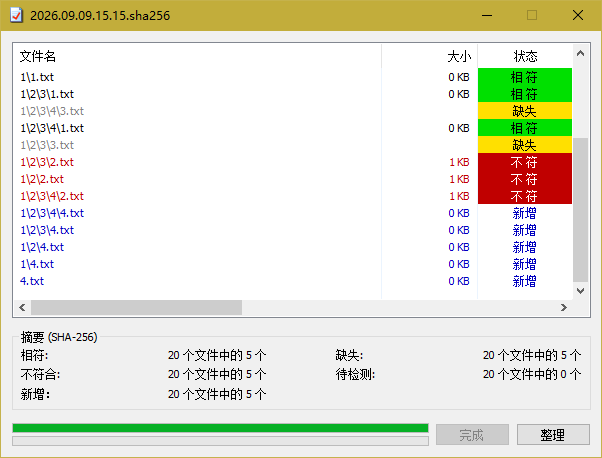
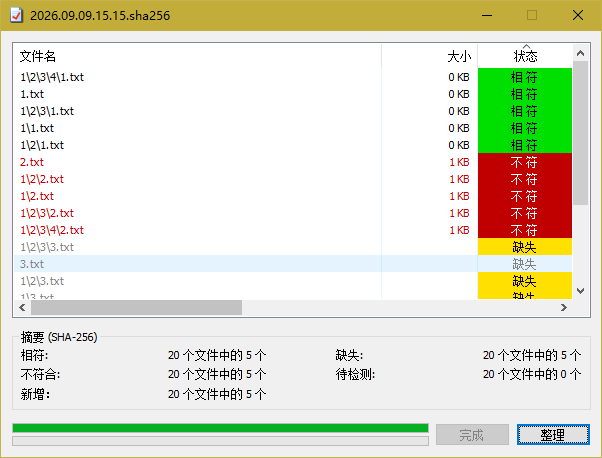
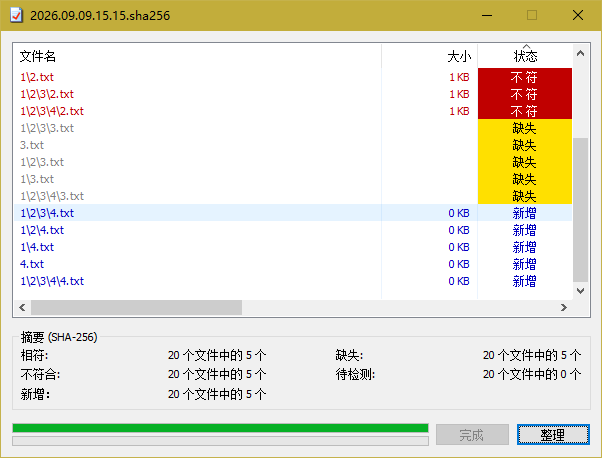
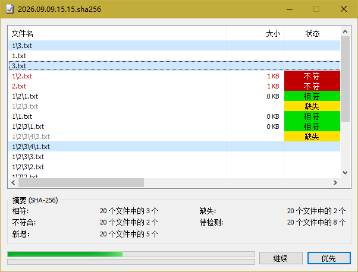

# HashCheckPRO

一个基于开源 [HashCheck](https://github.com/gurnec/HashCheck) Shell 扩展深度定制的文件哈希校验工具。
在保留原版右键集成、批量校验等能力的基础上，大幅扩展了算法支持与交互体验。

## 功能特性

- **19 种哈希算法**：CRC32、MD5、SHA-1、SHA-224/256/384/512、SHA3-224/256/384/512、BLAKE2b/2s、BLAKE3、SM3、SHAKE-128/256、RIPEMD-160、xxHash64
- **优先校验**：框选列表中的文件即可插队优先计算，算完自动停，无需全部重算
- **智能整理**：校验结果按状态自动排序（相符 → 不符 → 缺失 → 新增），一目了然
- **自动时间戳命名**：创建校验文件时默认按「年.月.日.时.分」命名
- **自检防篡改**：创建的校验文件内嵌自身哈希，打开时自动校验，若文件被改动即提示「校验文件损坏或被修改」
- **安装可选默认算法**：NSIS 安装向导可指定默认校验算法

## 功能演示

### 校验

右键选择文件或校验文件即可开始校验，结果实时显示并标注相符 / 不符状态：

### 整理

校验完成后，结果列表按状态自动整理排序，缺失与新增文件一目了然：

### 优先

校验过程中框选文件点击「优先」，选中的文件插队先算、算完即停：

## 安装

- 使用 NSIS 安装包安装（安装时可选择默认校验算法）
- 或手动注册 `HashCheck.dll`：`regsvr32 HashCheck.dll`

## 从源码构建

- 编译器：Microsoft Visual Studio 2022（Build Tools / Community 均可）
- 解决方案：`HashCheck.sln`
- 打包：NSIS（安装脚本位于 `installer/HashCheck.nsi`）

## 许可

3-Clause BSD License，详见 [license.txt](license.txt)。

本项目基于最初发布于 <http://code.kliu.org/hashcheck/> 的软件修改而来，原始作品版权归 Kai Liu 所有，后续贡献见 [version.h](version.h) 版权声明。