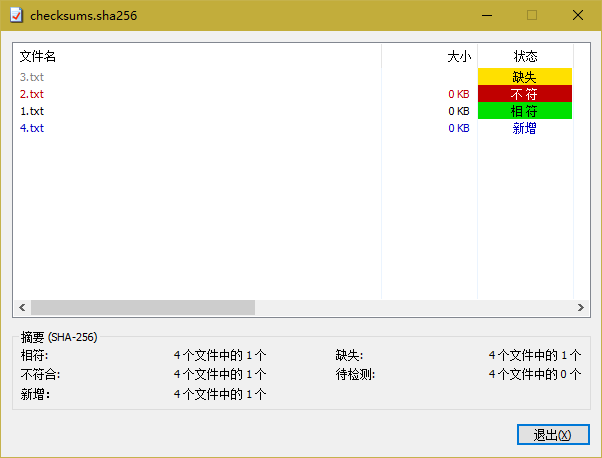

# HashCheck Shell Extension #

### Installation ###

The latest installer for Windows (Vista and later) can be found here:  
<https://github.com/gurnec/HashCheck>

## Building from source ##

#### Compiler ####

Microsoft Visual Studio 2015 (the free Community edition works well).

#### Localizations ####

Translation strings are stored as string table resources. These tables can be modified by editing [HashCheckTranslations.rc](HashCheckTranslations.rc).

#### License and miscellanea ####

Standard 3-Clause BSD License.

Please refer to [license.txt](license.txt) for details about distribution and modification.

This software is based on software originally distributed at:  
<http://code.kliu.org/hashcheck/>
